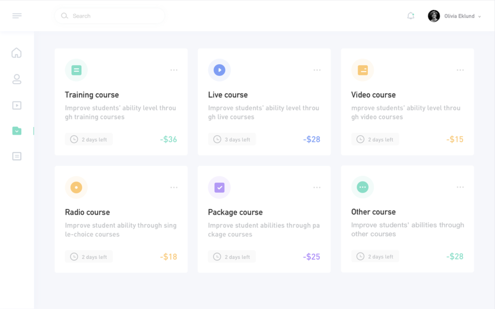

# Dashboard

Color de los menu: #FFF

Color del fondo: #E9EBF0

Color de las letras: #BFC5CB

Color negrita de las letras: #5E5E5E

Color verde: #49C4AD

Color naranja: #FFA541

color moradp: #625BF6

### Imagen a realizar
---

### Leer como estructurar el css segun el siguiente enlace
---

https://blog.interactius.com/metodolog%C3%ADa-css-block-element-modifier-bem-f26e69d1de3