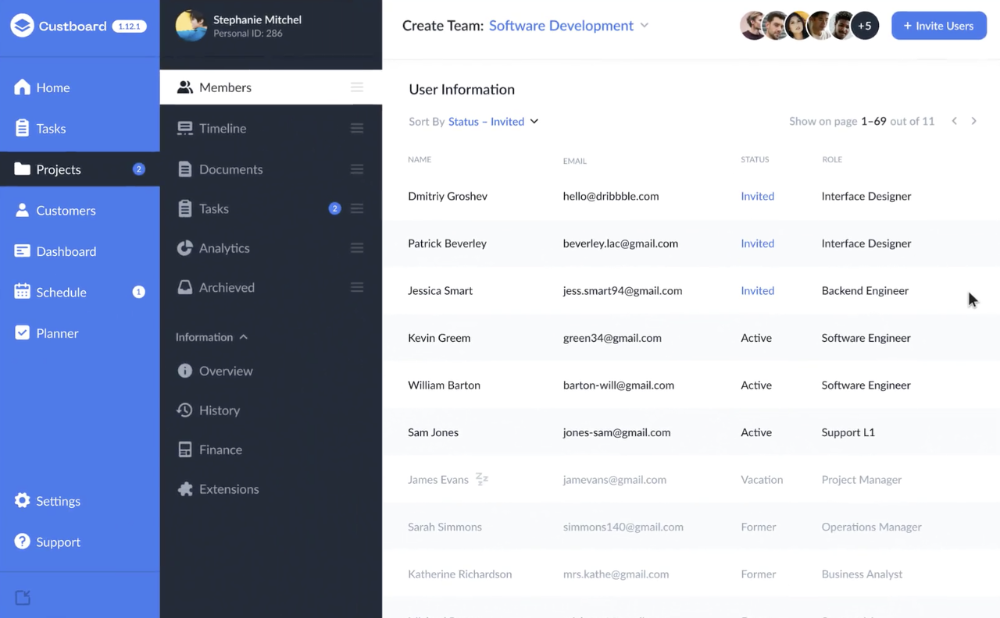

# Dashboard V2

Color de fondo zebra de la celda de la tabla: #F3F4F7

Color de las letras sobre menu oscuro: #B8BBC6

Color del menu oscuro: #4F505B

color del menu azul: #112CD3

### Formulario a realizar
---

sass sass/main.scss ./pagina.css